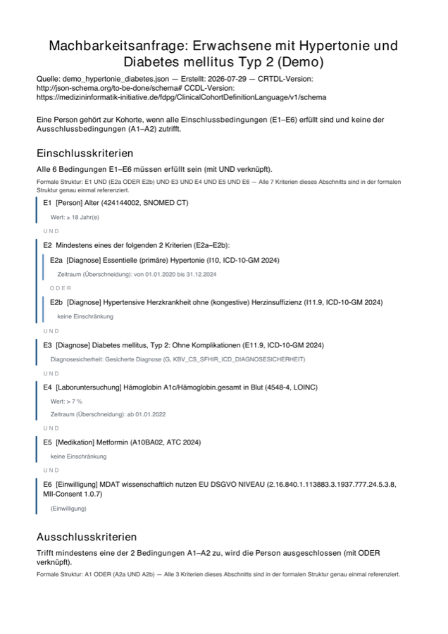
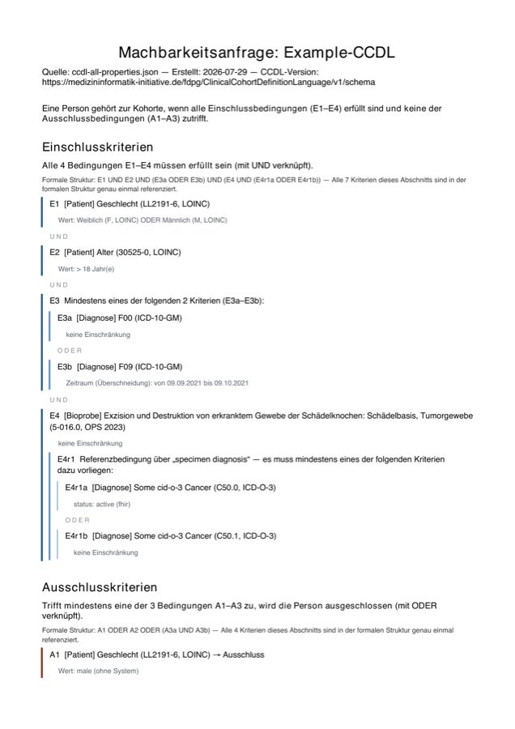

# crtdl-renderer

Turns a **CRTDL** feasibility query — the JSON a researcher exports from the German
[Forschungsdatenportal Gesundheit (FDPG)](https://forschen-fuer-gesundheit.de/) — into a
document a human can actually read: inclusion and exclusion criteria with German display
names, the boolean structure shown as structure, in Markdown, DOCX, PDF or CSV.

The JSON that travels with a data-use application is machine-readable and, by the format's
own admission, carries only a free-text `description` "to transport additional human-readable
information about the query". Use-&-Access-Committee members are asked to judge a cohort
definition they cannot see. This renders it.

```bash
pip install crtdl-renderer[all]
crtdl-render query.json -f pdf -o out/
```

## What the output looks like

<p align="center">
  
</p>

Every condition is a block on a coloured left rail that thins and lightens with depth; the
operator stands *between* blocks rather than in a column, and the label (`E2a`) carries the
group membership so the structure survives a page break. Exclusion criteria are marked four
ways — heading, section rule, `→ Ausschluss` on the block, and a warm rail — so nothing depends
on colour alone.

Full outputs for two queries are committed under
[`examples/rendered/`](examples/rendered/), in every format:

| Query | PDF | Markdown | DOCX | CSV |
|---|---|---|---|---|
| Demo: adults with hypertension **and** type-2 diabetes | [PDF](examples/rendered/demo_hypertonie_diabetes.pdf) | [MD](examples/rendered/demo_hypertonie_diabetes.md) | [DOCX](examples/rendered/demo_hypertonie_diabetes.docx) | [inclusion](examples/rendered/demo_hypertonie_diabetes_DE_Einschlusskriterien.csv) · [exclusion](examples/rendered/demo_hypertonie_diabetes_DE_Ausschlusskriterien.csv) · [features](examples/rendered/demo_hypertonie_diabetes_DE_Merkmalselektion.csv) |
| MII spec example — three nesting levels, reference condition | [PDF](examples/rendered/ccdl-all-properties.pdf) | [MD](examples/rendered/ccdl-all-properties.md) | [DOCX](examples/rendered/ccdl-all-properties.docx) | [inclusion](examples/rendered/ccdl-all-properties_DE_Einschlusskriterien.csv) · [exclusion](examples/rendered/ccdl-all-properties_DE_Ausschlusskriterien.csv) |

The second one is the interesting case — `E4` contains a reference condition `E4r1`, which in
turn contains `E4r1a` / `E4r1b` joined by ODER:

<p align="center">
  
</p>

See [docs/layout.md](docs/layout.md) for the layout's design rules.

## Usage

```bash
crtdl-render FILE [-f md|docx|pdf|csv|all] [-o OUTDIR]
                  [--layout cards|table] [--cache PATH] [--online]
```

| Option | Effect |
|---|---|
| `-f` | output format; `csv` emits the FDPG's own committee column set |
| `--layout cards` | nested blocks (default) |
| `--layout table` | flat grid, if a reader prefers one |
| `--cache PATH` | additional terminology cache (see below) |
| `--online` | look up missing German names via FHIR `$lookup`; results persist only if `--cache` names a file |

## German display names

Codes render as `Deutscher Name (Code, System Version)`. Resolution is layered: an optional
bulk cache, then the packaged curated cache, then the display embedded in the export, then the
bare code. Codes whose German name could not be verified are listed in a footnote — the
renderer never invents a translation.

For full coverage, import the FDPG ontology once (no authentication, ~120 MB):

```bash
curl -L -o elastic.zip \
  https://github.com/medizininformatik-initiative/fhir-ontology-generator/releases/download/v4.2.2/elastic.zip
python -m crtdl_renderer.ontology elastic.zip -o ontology_de.json
crtdl-render query.json --cache ontology_de.json -f pdf -o out/
```

That yields ~639,000 names — the same labels the FDPG interface shows. The rule that matters:
German is `display.de || display.original`, never `de` alone, because BfArM systems
(ICD-10-GM, OPS, ATC, Alpha-ID) are natively German and leave `de` empty.
See [docs/terminology.md](docs/terminology.md).

Each document ends with a **Kodiersysteme** appendix listing every code system used with its
full URI and versions, so the short labels in the criteria (`ICD-10-GM`) remain traceable to the
exact system in the export — and a warning marks any short label that stands for more than one
URI.

## Semantics

`inclusionCriteria` is CNF (outer AND of inner ORs); `exclusionCriteria` is DNF (outer OR of
inner ANDs); the cohort is inclusion **AND NOT** exclusion. The nesting inverts between the two
sections, which is the format's most dangerous property for a reader, so each section spells
its own rule out in words. Full notes in [docs/format.md](docs/format.md).

## Documentation

- [docs/format.md](docs/format.md) — CRTDL/CCDL structure, boolean semantics, tolerated deviations
- [docs/layout.md](docs/layout.md) — the rendering design and its rules
- [docs/terminology.md](docs/terminology.md) — German display resolution and the ontology import

## Development

```bash
pip install -e ".[all]"
python tests/test_renderer.py      # assert-based, no framework
```

`examples/` holds queries written for this project; `examples/upstream/` holds 56 real queries
from the MII CRTDL and CCDL specs, TORCH and cctb, redistributed under Apache-2.0 with
attribution (see [examples/upstream/README.md](examples/upstream/README.md)). The test suite
runs against all of them.

## Status

1.0 — the command-line interface and the output structure are stable; breaking either takes a
major version.

Exercised against 57 queries from the CRTDL and CCDL specifications, TORCH's test resources
and cctb's CQL corpus. **Not yet validated against a production FDPG export**: every fixture
comes from a spec repository or a reference implementation, and those already deviate from the
published schema in six documented ways, so live exports may hold a seventh. If you have a real
query, a bug report with it attached is the most useful thing you could send.

## Licence and attribution

Apache License 2.0 — see [LICENSE](LICENSE). Attribution for everything this project builds on
is in [NOTICE](NOTICE): the redistributed MII example queries, the CRTDL/CCDL specifications,
the FDPG ontology, the code systems whose German designations appear in the curated seed
(ICD-10-GM/OPS/ATC from BfArM, LOINC, SNOMED CT, MII Broad Consent, KBV, HL7 FHIR), the
reference implementations consulted for the layout, and the optional runtime dependencies.

The code systems themselves remain under their own terms; this project grants no rights to
them.
